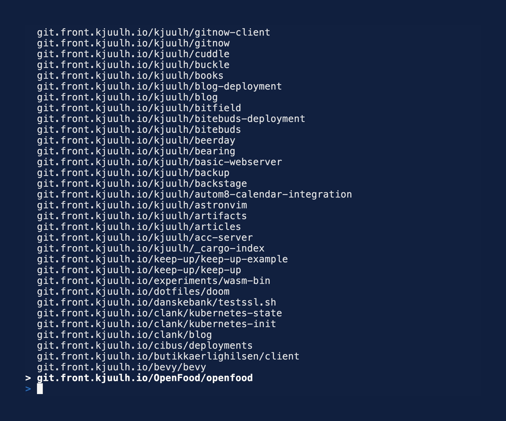

# Git Now

> https://gitnow.kjuulh.io/

Git Now is a utility for easily navigating git projects from common upstream providers. Search, Download, and Enter projects as quickly as you can type.



## Installation

### Homebrew

```bash
brew tap kjuulh/tap https://git.kjuulh.io/kjuulh/homebrew-tap
brew install gitnow
```

### Cargo

```bash
cargo install gitnow
# or
cargo binstall gitnow
```

### Setup

```bash
# You can either use gitnow directly (and use spawned shell sessions)
gitnow

# Or install gitnow scripts (in your .bashrc, .zshrc) this will use native shell commands to move you around
eval "$(gitnow init zsh)"
git-now # Long
gn # Short alias
```

## Reasoning

How many steps do you normally do to download a project?

1. Navigate to github.com
2. Search in your org for the project
3. Find the clone url
4. Navigate to your local github repositories path
5. Git clone `<project>` 
6. Enter new project directory

A power user can of course use `gh repo clone` to skip a few steps.

With gitnow

1. `git now`
2. Enter parts of the project name and press enter
3. Your project is automatically downloaded if it doesn't exist in an opinionated path dir, and move you there.

## Configuration

Configuration lives at `~/.config/gitnow/gitnow.toml` (override with `$GITNOW_CONFIG`).

### Custom clone command

By default gitnow uses `git clone`. You can override this with any command using a [minijinja](https://docs.rs/minijinja) template:

```toml
[settings]
# Use jj (Jujutsu) instead of git
clone_command = "jj git clone {{ ssh_url }} {{ path }}"
```

Available template variables: `ssh_url`, `path`.

### Worktrees

gitnow supports git worktrees (or jj workspaces) via the `worktree` subcommand. This uses bare repositories so each branch gets its own directory as a sibling:

```
~/git/github.com/owner/repo/
├── .bare/          # bare clone (git clone --bare)
├── main/           # worktree for main branch
├── feature-login/  # worktree for feature/login branch
└── fix-typo/       # worktree for fix/typo branch
```

Usage:

```bash
# Interactive: pick repo, then pick branch
gitnow worktree

# Pre-filter repo
gitnow worktree myproject

# Specify branch directly
gitnow worktree myproject -b feature/login

# Print worktree path instead of entering a shell
gitnow worktree myproject -b main --no-shell
```

All worktree commands are configurable via minijinja templates:

```toml
[settings.worktree]
# Default: "git clone --bare {{ ssh_url }} {{ bare_path }}"
clone_command = "git clone --bare {{ ssh_url }} {{ bare_path }}"

# Default: "git -C {{ bare_path }} worktree add {{ worktree_path }} {{ branch }}"
add_command = "git -C {{ bare_path }} worktree add {{ worktree_path }} {{ branch }}"

# Default: "git -C {{ bare_path }} branch --format=%(refname:short)"
list_branches_command = "git -C {{ bare_path }} branch --format=%(refname:short)"
```

For jj, you might use:

```toml
[settings]
clone_command = "jj git clone {{ ssh_url }} {{ path }}"

[settings.worktree]
clone_command = "jj git clone {{ ssh_url }} {{ bare_path }}"
add_command = "jj -R {{ bare_path }} workspace add --name {{ branch }} {{ worktree_path }}"
list_branches_command = "jj -R {{ bare_path }} bookmark list -T 'name ++ \"\\n\"'"
```

Available template variables for worktree commands: `bare_path`, `worktree_path`, `branch`, `ssh_url`.

### Projects

gitnow supports scratch-pad projects that group multiple repositories into a single directory. This is useful when working on features that span several repos.

```bash
# Create a new project (interactive repo selection)
gitnow project create my-feature

# Create from a template
gitnow project create my-feature -t default

# Open an existing project (interactive selection)
gitnow project

# Open by name
gitnow project my-feature

# Add more repos to a project
gitnow project add my-feature

# Delete a project
gitnow project delete my-feature
```

Project directories live at `~/.gitnow/projects/` by default. Templates live at `~/.gitnow/templates/`. Both are configurable:

```toml
[settings.project]
directory = "~/.gitnow/projects"
templates_directory = "~/.gitnow/templates"
```

Commands that navigate to a directory (`gitnow`, `gitnow project`, `gitnow project create`, `gitnow worktree`) will `cd` you there when using the shell integration. Commands that don't produce a path (`project add`, `project delete`, `update`) run normally without changing your directory.

### Shell integration

The recommended way to use gitnow is with shell integration, which uses a **chooser file** to communicate the selected path back to your shell:

```bash
eval "$(gitnow init zsh)"
git-now    # or gn
```

When you run `git-now`, the shell wrapper:

1. Creates a temporary chooser file
2. Runs `gitnow` with the `GITNOW_CHOOSER_FILE` env var pointing to it
3. If gitnow writes a path to the file, the wrapper `cd`s there
4. If the file is empty (e.g. after `git-now project delete`), no `cd` happens

This works uniformly for all subcommands:

```bash
git-now                      # pick a repo and cd there
git-now project              # pick a project and cd there
git-now project create foo   # create project and cd there
git-now project delete foo   # deletes project, no cd
git-now worktree             # pick repo+branch worktree, cd there
```

You can also set the chooser file manually for scripting:

```bash
GITNOW_CHOOSER_FILE=/tmp/choice gitnow project
# or
gitnow --chooser-file /tmp/choice project
```
